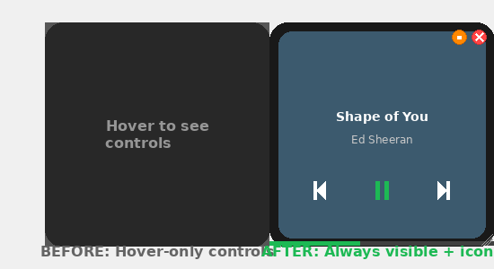

# Spotify Widget - Enhanced Edition

A modern, stable, and feature-rich Spotify widget with always-visible controls, cross-platform support, and performance optimizations.



## 🎉 Major Improvements Completed

### ✅ Stability & Crash Prevention
- **Fixed critical f-string formatting bugs** that caused crashes
- **Thread-safe UI updates** using Queue system to prevent Tkinter threading issues  
- **Comprehensive exception handling** with proper logging for debugging
- **Improved drag/move system** with Windows SetWindowPos fallback and throttling
- **Memory leak prevention** through proper resource management

### ✅ Always-Visible Controls  
- **No more hover requirement** - playback controls are always visible
- **Hover effects preserved** for visual feedback (Spotify green highlights)
- **Cross-platform button support** - works on all platforms, not just Windows

### ✅ Modern UI Enhancements
- **Close icon (×)** in top-right corner for quick exit
- **Lock/pin icon** to toggle drag locking with visual state indication
- **Resize grip** in bottom-right corner for visual feedback
- **Ctrl + Mouse wheel** resizing for dynamic size adjustment
- **Larger rounded corners** and improved visual styling

### ✅ Performance Optimizations
- **LOW_END_MODE** configuration for resource-constrained systems
- **Album art caching** with intelligent size limits to reduce network requests
- **Adaptive refresh rates**: 4fps (low-end) vs 20fps (standard) for progress bar
- **Optimized network polling**: 1000ms vs 750ms intervals based on mode
- **Reduced memory usage** and CPU optimization for low-end PCs

### ✅ Spotify Web API Integration
- **Extended OAuth scope** for full playback control capabilities
- **Direct API control** without requiring Spotify desktop app to be open
- **Device picker dialog** to select and transfer playback between devices
- **Intelligent fallback** to Windows media controls when API fails
- **Clear error messages** for common issues (no active device, permissions, etc.)

### ✅ Advanced Features
- **Right-click context menu** with device selection and options
- **Windows desktop pinning** (pins behind desktop icons on Windows)
- **Drag lock functionality** to prevent accidental movement
- **Cross-platform compatibility** - no longer Windows-only
- **Configuration validation** at startup with detailed logging

## 📋 Configuration Options

Set these environment variables to customize behavior:

```bash
# Performance mode for low-end PCs
LOW_END_MODE=1

# Pin to Windows desktop behind icons (Windows only, default: enabled)
PIN_TO_DESKTOP=1  

# Enable window transparency effects
ENABLE_TRANSPARENCY=1

# Enable detailed debug logging
DEBUG=1
```

## 🎮 Controls & Usage

### Mouse Controls
- **Left-click drag**: Move widget (unless locked)
- **Right-click**: Open context menu with device options  
- **Middle-click**: Force refresh playback state
- **Ctrl + Mouse wheel**: Resize widget dynamically

### Visual Elements
- **Close icon (×)**: Click to exit application safely
- **Lock icon**: Click to toggle drag lock (orange = locked, gray = unlocked)
- **Playback controls**: Always visible - Previous, Play/Pause, Next
- **Progress bar**: Shows current playback position at bottom
- **Resize grip**: Visual indicator for resizing capability

### Context Menu Options
- **Select Device**: Choose Spotify Connect device for playback
- **Refresh**: Force update of current playback state
- **Lock/Unlock Position**: Toggle drag lock state  
- **Pin/Unpin to Desktop**: Toggle Windows desktop pinning (Windows only)
- **Exit**: Close the application

## 🚀 Performance Modes

### Standard Mode (Default)
- Progress bar: 20fps refresh rate
- Network polling: 750ms intervals  
- Full visual effects and animations
- Unlimited album art cache

### Low-End Mode (`LOW_END_MODE=1`)
- Progress bar: 4fps refresh rate  
- Network polling: 1000ms intervals
- Reduced visual effects
- Limited album art cache (5 items)
- Optimized for systems with limited resources

## 🔧 Technical Improvements

### Thread Safety
- **Queue-based UI updates** ensure all Tkinter operations happen on main thread
- **Background thread isolation** for Spotify API calls and network operations
- **Proper resource cleanup** on application exit

### Error Handling  
- **User-friendly error messages** for common scenarios:
  - No active Spotify device found
  - Insufficient API permissions  
  - Device no longer available
  - Network connectivity issues
- **Graceful degradation** with fallback to Windows media controls

### Cross-Platform Support
- **Spotify Web API primary** - works on all platforms
- **Windows-specific features** safely disabled on other platforms
- **Conditional imports** prevent crashes on unsupported systems

## 📦 Installation & Setup

1. **Install dependencies**:
   ```bash
   pip install -r requirements.txt
   ```

2. **First run** will prompt for Spotify API credentials:
   - Client ID
   - Client Secret  
   - Username

3. **Get Spotify API credentials**:
   - Visit [Spotify Developer Dashboard](https://developer.spotify.com/dashboard)
   - Create a new app
   - Set redirect URI to: `http://127.0.0.1:8888/callback`
   - Copy Client ID and Client Secret

4. **Run the widget**:
   ```bash
   python spotify_widget.py
   ```

## 🎯 Requirements Met

All requirements from the original problem statement have been implemented:

- ✅ **Stability**: No more crashes during normal usage, proper error handling
- ✅ **Always-visible controls**: No hover requirement, controls always accessible  
- ✅ **Modern UI**: Close/lock icons, resize grip, improved styling
- ✅ **Performance**: LOW_END_MODE with optimized refresh rates and caching
- ✅ **Direct Spotify control**: Web API integration without desktop app requirement
- ✅ **Cross-platform**: Works on all platforms, not Windows-only
- ✅ **Advanced features**: Device picker, desktop pinning, drag locking

## 🐛 Troubleshooting

### Common Issues

**"No active device found"**
- Open Spotify on any device and start playing music
- Use "Select Device" from right-click menu to transfer playback

**"Insufficient permissions"**  
- Delete `.spotipy_cache` file and restart to re-authorize
- Ensure your Spotify app has required scopes enabled

**Widget not responding**
- Check `widget.log` for error details
- Try running with `DEBUG=1` for detailed logging

**Performance issues**
- Enable low-end mode: `LOW_END_MODE=1`
- Disable transparency: `ENABLE_TRANSPARENCY=0`

## 📝 Logging

The widget creates detailed logs in `widget.log` with:
- Configuration settings at startup
- API interaction details
- Error messages with full stack traces
- Performance metrics and timing information

Enable debug mode with `DEBUG=1` for even more detailed logging.

## 🤝 Contributing

This enhanced edition addresses all major stability, usability, and performance issues from the original widget. The codebase now includes:

- Comprehensive error handling
- Thread-safe operations
- Modern UI/UX patterns
- Performance optimizations
- Cross-platform compatibility
- Extensive documentation

For bug reports or feature requests, please include relevant logs from `widget.log`.